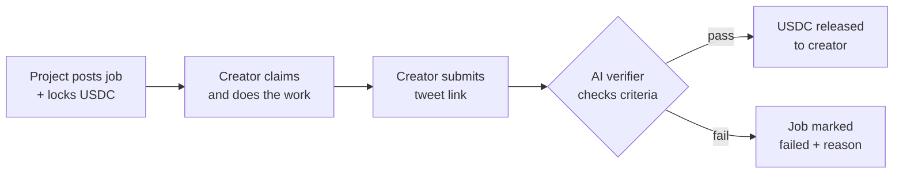

# Claimr

A marketplace where crypto projects and creators settle deals through AI-verified work and instant USDC payouts on Arc Testnet.

A project posts a job, locks USDC in escrow, and writes verification criteria (for example: "3 tweets mentioning @YourProject with 50K combined impressions"). A creator claims the job, does the work, and submits a link. An AI verifier checks the submission against the criteria and either releases the escrow to the creator or rejects with a reason. No middleman, no manual back-and-forth, no chasing payment.

Live demo: [claimr.vercel.app](https://claimr.vercel.app)

---

## How it works



Six on-chain states a job can be in: Open, Claimed, Submitted, Completed, Cancelled, Failed.

---

## Stack

| Layer | Choice |
|---|---|
| Frontend | Next.js 16, React 19, Turbopack |
| Styling | Tailwind v4, Lucide icons |
| Chain | Arc Testnet (Circle's EVM L2) |
| Wallet | Circle's user-controlled wallets (email + PIN) **or** any injected wallet (MetaMask, Rabby, Brave) |
| Verifier | Anthropic Claude API |
| Reads | wagmi + viem |
| Writes | Circle SDK for email users, wagmi for wallet users |
| Hosting | Vercel |

---

## Run it locally

```bash
git clone https://github.com/iam25th1/claimr.git
cd claimr
npm ci
cp .env.example .env.local   # fill in the values below
npm run dev
```

Then open [http://localhost:3000](http://localhost:3000).

### Required environment variables

```bash
# Client-side (must be NEXT_PUBLIC_)
NEXT_PUBLIC_CIRCLE_APP_ID=xxxxxxxxxxxx
NEXT_PUBLIC_ADMIN_WALLETS=0xaaa...,0xbbb...

# Server-side
CIRCLE_API_KEY=TEST_API_KEY:xxxxxxxx
ANTHROPIC_API_KEY=sk-ant-...
VERIFIER_PRIVATE_KEY=0x...        # signs verifyWork/rejectWork
ADMIN_EMAILS=you@example.com      # comma-separated, lowercase
```

All comma-separated values can have any whitespace and any case. They're trimmed and lowercased before use.

---

## Architecture

<details>
<summary>Auth flows</summary>

Two ways in:

**Email (Circle).** User enters email, gets an OTP, sets a six-digit PIN, Circle creates a non-custodial wallet. Every transaction prompts the PIN. State is held in an httpOnly session cookie.

**Wallet (injected).** User clicks Connect MetaMask, approves in the extension, done. No PIN, no email. State is held in wagmi's account hook. Transactions are signed in MetaMask.

Both modes share the same read paths and the same UI. The write hook (`useCircleWrite`) branches internally based on `user.provider`.
</details>

<details>
<summary>Admin panel</summary>

Lives at `/hq/c8m4z2/` (URL is deliberately obscure). Two-layer gate:

- **Client.** UI gated by `NEXT_PUBLIC_ADMIN_WALLETS` allowlist via `useIsAdmin()` hook.
- **Server.** Write APIs (`/api/admin/*`) read the session cookie's email and check it against `ADMIN_EMAILS`. This is the actual gate.

Admin features: KPI overview, jobs table with manual approve/reject, verifier queue, activity log, post platform jobs (auto-tagged with a "Platform" badge across the marketplace).
</details>

<details>
<summary>Verifier</summary>

`POST /api/verify` accepts a job ID and a submission URL. It fetches the tweet via X's oEmbed endpoint, asks Claude to evaluate it against the job's criteria, and based on the answer either calls `verifyWork(jobId)` or `rejectWork(jobId, reason)` on chain using `VERIFIER_PRIVATE_KEY`. Reasoning is stored in an in-memory log accessible from the admin panel.
</details>

<details>
<summary>Contracts</summary>

Single escrow contract on Arc Testnet at `0x1a0f14f7485664F10bF32A0C94163Ec50a674900`. Functions:

- `postJob(title, criteria, amount, durationDays, isPrivate, invitedCreator)` — project locks USDC and posts
- `claimJob(jobId)` — creator stakes their claim
- `submitWork(jobId, submissionData)` — creator submits proof
- `verifyWork(jobId)` — verifier releases escrow (5% platform fee)
- `rejectWork(jobId, reason)` — verifier marks failed
- `getJob(jobId)` — read job state
- `jobCount()` — total jobs ever posted

One claimer per job. Multi-creator postings are a UI workaround: N sibling jobs with the same title.
</details>

---

## Deploy

Pushes to `main` auto-deploy via Vercel. To deploy your own:

1. Fork the repo
2. Connect it to Vercel
3. Set the env vars from above in **Settings → Environment Variables**
4. Push to main

The build uses Turbopack. Production build sanity check locally with `npm run build`.

---

## Development

| Task | Command |
|---|---|
| Dev server | `npm run dev` |
| Type-check | `npx tsc --noEmit` |
| Lint | `npm run lint` |
| Production build | `npm run build` |

`package-lock.json` is committed and is the source of truth. Use `npm ci` in CI and Railway/Vercel builds — never `npm install` — to guarantee a deterministic dependency tree.

---

## License

MIT.
